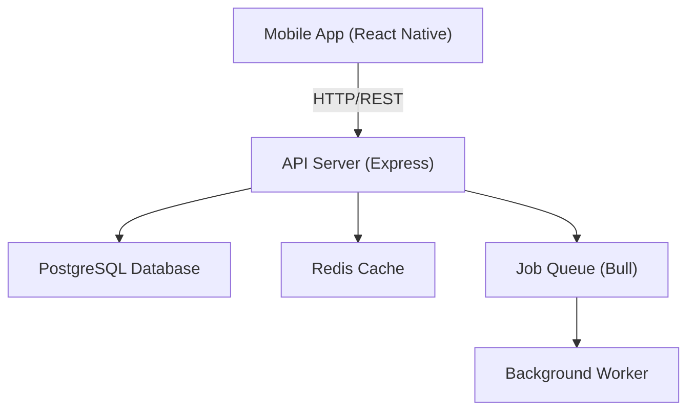

# Architecture Documentation Template

Use this template for documenting system design, architecture decisions, and high-level diagrams.

## File Location
`docs/architecture/<filename>.md`

## Template

```markdown
---
title: System Architecture
description: High-level overview of the system design and component interactions
sidebar_position: 1
---

# System Architecture

## Overview
Brief one-paragraph summary of what this document covers.

## High-Level Diagram


## Components

### Component Name
**Purpose**: What this component does  
**Technology**: Framework/library used  
**Key Features**:
- Feature 1
- Feature 2

**Example**:
```typescript
// Implementation example
```

## Data Flow

### Flow Name
Description of the data flow from component A to component B.

1. Step 1: User does X
2. Step 2: System processes Y
3. Step 3: Result returned to Z

## Design Decisions

### Decision 1: Why MobX for State Management?
**Rationale**: 
- Reactive programming model fits real-time updates
- Fine-grained reactivity without boilerplate
- Good for mobile performance

**Trade-offs**:
- Learning curve for team unfamiliar with observables
- Requires decorators or makeAutoObservable

## External Dependencies

| Service | Purpose | API | Status |
|---------|---------|-----|--------|
| Stripe | Payments | REST API | Production |
| Firebase | Push notifications | SDK | Production |
| Google Maps | Navigation | REST API | Production |

## Deployment Architecture

```
┌─────────────────────────────────────┐
│       Mobile Devices (iOS/Android)  │
└──────────────┬──────────────────────┘
               │
        ┌──────▼──────┐
        │  API Server │
        │  (Express)  │
        └──────┬──────┘
               │
        ┌──────▼──────────┐
        │   PostgreSQL    │
        │   Redis Cache   │
        │   Job Queue     │
        └─────────────────┘
```

## Performance Considerations

- Caching strategy: ...
- Database indexing: ...
- API rate limiting: ...
- Mobile bandwidth optimization: ...

## Security Architecture

- Authentication: JWT with 15m access tokens
- Authorization: Role-based access control (RBAC)
- Data encryption: TLS in transit, at-rest for sensitive fields
- Secrets management: Environment variables

## Related Documentation
- [API Design Guidelines](../guidelines/api-design.md)
- [Database Schema](./entity-models.md)
- [Deployment Guide](../setup/deployment.md)
```

## Best Practices

1. **Use diagrams** — Include Mermaid diagrams for visual clarity
2. **Explain rationale** — Document "why", not just "what"
3. **Reference standards** — Link to code style/guidelines docs
4. **Keep updated** — Sync with actual implementation
5. **Include examples** — Code snippets for key patterns
6. **Document trade-offs** — Explain decisions and alternatives
